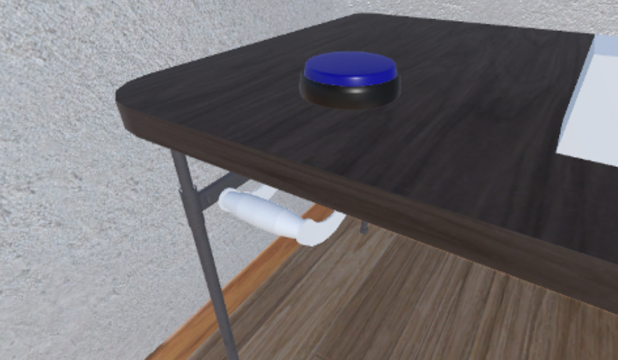

# Magic Xroom

## Description

The Magic XRoom is a Virtual Reality (VR) application developed to elicit specific emotions and gather data from external sensors through a set of scenarios. The application allows the user to experience four different scenarios composed of increasingly difficult tasks that require various skills to complete within a time limit.

The data collected with the Magic XRoom is organized, annotated and written to CSV files to facilitate its analysis. The sensors compatible with the Magic XRoom are the following:

- Virtual Reality headset and controllers (mandatory)
  - Collect position and rotation.
- Shimmer 3 GSR+ device (optional)
  - Collect position, rotation, acceleration, galvanic skin response (GSR, EDA), photoplethysmography (PPG, BVP), and heart rate (generated from the PPG data).
- Lip and Eye tracking devices (optional)
  - Collect eyes and lip features.

## Prerequisites

The Magic XRoom is compatible only with Microsoft Windows 10 (or higher) x64 systems. The current Unity project is built on version 2021.3.11f1, other versions have not been tested.

Additional files can be found <a href="https://drive.google.com/drive/folders/1WX8hqChTCXW1NiQsLzY5wymr0dd7Blsp?usp=sharing">here</a> and must be included in the Unity project prior to opening it the first time. Extract the contents of the compressed file in the directory `Assets/XR2Learn/Environment`, thus creating a new folder `Models`.

The minimum requirements in terms of hardware sensors are a Virtual Reality headset and Virtual Reality controllers. For this the software required is:

- SteamVR (downloaded with Steam)
- VR headset linking/streaming software, i.e.
  - _VIVE Focus 3_ requires VIVE Business Streaming;
  - _Oculus Quest_ requires the Oculus Desktop App.
  
## Versions

Executables for the Magic Xroom can be found at the following links:

- <a href="https://drive.google.com/file/d/17Z0y-C6-brqVHYVM1DW26l3PzN4FvaZw/view?usp=sharing">Magic Xroom v1.0</a/>
- <a href="https://drive.google.com/file/d/1drwbWHae6RPAt2eQTEAP8JWgdKB722Vs/view?usp=sharing">Magic Xroom v1.1</a/>

## Installation

To build the Magic Xroom simply open the Unity project (after importing the additional required files) and build for Windows x64.

Depending on which external sensors will be used during the data collection, additional software must be installed and configured prior to launching the Magic XRoom application.

To use face/eye tracking:

- SRanipal runtime (included in _VIVE Console for SteamVR_ on Steam);
- The computer and the VR hardware must be connected to the same 5GHz WiFi network. The Windows _mobile hotspot_ has shown promising results during testing when a WiFi network is unavailable or restricted.

To use a _Shimmer 3 GSR+_ device:

- No additional software is required, but the sensor must be configured with the _LogAndStream_ firmware;
- Bluetooth 5.1+ availability required;
- The Shimmer sensor must be paired with the computer before starting the application.

_Refer to the official ShimmerGSR+ documentation:_
<https://shimmersensing.com/wp-content/docs/support/documentation/GSR_User_Guide_rev1.13.pdf>

## Basic User Manual

The actions mapped to the VIVE Focus 3 controllers are the following (mirrored on the left controller):

### Setup

The following are the recommended steps to successfully launch and use the Magic XRoom with a VIVE Focus 3. Due to the nature of VR hardware/software and their environments, alternative methods might work but it is up to the user to choose which to follow and ensure the software works as intended.

_Note: software versions shown in images might differ_

1. Download the required software and setup the hardware
    1. Link the VR headset and controllers, pair the Shimmer sensor, connect to a strong WiFi if eye/face tracking is enabled
2. Launch VIVE Streaming Business and SteamVR

    

3. Launch VIVE SRanipal (Steam version) if eye/face tracking is enabled (it launches automatically at point 5. but this step ensures the correct version is used in case multiple versions are installed on the computer)
    1. Default install directory is `<steam install directory>\steamapps\common\VIVEDriver\App\SRanipal`
    2. When successfully connected with the eye tracking accessory the tray icon should change color (same for mouth tracking).

      

    _Note: In the new versions of the software, the icon turns blue when connected, instead of green._

4. Configure the user settings if necessary (explained further down)
5. Launch the Magic XRoom executable (SteamVR starts automatically if point 2. was skipped)

At this point the user should be within the virtual world of the Magic XRoom.

In order to start the data collection one last step is required:

  

The buttons shown in the above picture are used to start/stop the data collection. The panel shows the current state of the data collection [  /  ] and the current state of the Shimmer device [  /  /  /  /  ]. If the Shimmer sensor is used, it's important to wait until it shows a  state before starting the data collection and wait for it to turn into the  state, otherwise no data will be collected for this sensor.

It is possible to work on multiple sessions without restarting the application by starting/stopping the data collection. Each time a new data collection is started a unique set of files is generated.

### User Settings

The Magic XRoom application can be configured with an external file to enable/disable some features or to tweak parameters related to the data collection.

The configuration file can be found in a subfolder of the directory of the executable:

`<Magic Xroom directory>\xr2learn-magicxroom\_Data\StreamingAssets\UserSettings.xml`

For all sensors that require **samplingRate** or **samplingBufferSize**, to calculate the delay Δt in [s] between each write operation for a specific sensor use the following formula:

$Δt={samplingBufferSize \over samplingRate}$

Higher values will impact less on performance but will result in more data being lost in case of abrupt interrupts in the data collection.

Example: with a _**samplingBufferSize**_ of 50 and a _**samplingRate**_ of 10Hz the resulting delay will be 5s, meaning that at most 5s of data might be lost in case of unexpected errors or problems with the application/hardware/connection.

The `UserSettings.xml` file contents are the following:

- **keyboard**
  - **enableShortcuts** [true/false] =\> enables/disables the following keyboard shortcuts (the application window must be focused to receive keyboard inputs):
    - **F**=\> manually shows the Feedback Board
    - **D**=\> toggles (start/stop) the data collection
- **dataCollection**
  - **outputPath** [Windows compatible directory] =\> specifies the location where the data collection files will be generated. If left empty the default location is the same as the executable file. Ensure read/write operations are allowed for the current user
- **vr**
  - **config**
  - **samplingRate** [integer] =\> the frequency in [Hz] at which the application will sample data from the VR headset and controllers
  - **samplingBufferSize** [integer] =\> the number of samples buffered before writing to file
- **shimmer**
  - **enabled** [true/false] =\> enable/disable the Shimmer sensor data collection
  - **deviceName** [any] =\> the Shimmer device internal name
  - **config**
    - **heartbeatsToAverage** [integer] =\> the number of heartbeat inputs used to calculate an average. Higher values tend to generate better results but sometimes break due to the volatility of the Bluetooth communication, i.e. if the value is set to 10 and one of the 10 inputs is corrupted or invalid, the overall average will be invalid for the next 10 calculations.
    - **trainingPeriodPPG** [integer] =\> the delay in [s] before the PPG signal is able to calculate a heartbeat
    - **samplingRate** [integer] =\> the frequency in [Hz] at which the application will sample data from the Shimmer sensor
    - **samplingBufferSize** [integer] =\> the number of samples buffered before writing to file.
  - **sensors**
    - **enableAccelerator** [true/false] =\> enables/disables the Shimmer internal accelerator sensor
    - **enableGSR** [true/false] =\> enables/disables the Shimmer internal GSR sensor
    - **enablePPG** [true/false] =\> enables/disables the Shimmer internal PPG sensor
- **eyeTracking**
  - **enabled** [true/false] =\> enables disables eye tracking
  - **config**
    - **samplingRate** [integer] =\> the frequency in [Hz] at which the application will sample data from the eye tracking sensor
    - **samplingBufferSize** [integer] =\> the number of samples buffered before writing to file.
- **faceTracking**
  - **enabled** [true/false] =\> enables disables face tracking
  - **config**
    - **samplingRate** [integer] =\> the frequency in [Hz] at which the application will sample data from the face tracking sensor
    - **samplingBufferSize** [integer] =\> the number of samples buffered before writing to file.
- **feedback**
  - **enabled**[true/false] =\> enables disables the feedback feature
  - **afterScenario** [true/false] =\> show the feedback panel at the end of a scenario
  - **afterLevel** [true/false] =\> show the feedback panel at the end of each level

Note that in case the `UserSettings.xml` file is not found in the specified directory or in case of any erroneous or missing data, the application will use any or all the default values shown in the below image and in the original file provided with the executable.

It is advised to modify the `UserSettings.xml` file and disable any sensors not in use to avoid unnecessary burden on the application.

  

### Output data and files

The output of the Magic XRoom is a set of files containing the data collected by the sensors enabled prior to launching the application.

Each of the enabled sensors will generate a comma-separated values (CSV) file sharing a unique identifier for the session, using the following naming convention:

`data_collection_<session ID>_<sensor type>.csv`

The session ID is generated as a number referring to the number of ticks since midnight 01.01.0001. Each tick represents 100 nanoseconds and to retrieve the corresponding date, input the number in an epoch converter (compatible with C# DateTime).

#### VR

`data_collection_<session ID>_VR.csv`

Contains the data collected from the Virtual Reality Headset and Controllers.
 The columns represent the position and rotation of the headset and controllers:

- timestamp =\> application timestamp
- head\_pos\_x =\> headset absolute position x axis
- head\_pos\_y =\> headset absolute position y axis
- head\_pos\_z =\> headset absolute position z axis
- head\_rot\_x =\> headset absolute rotation x (quaternion)
- head\_rot\_y =\> headset absolute rotation y (quaternion)
- head\_rot\_z =\> headset absolute rotation z (quaternion)
- head\_rot\_w =\> headset absolute rotation w (quaternion)
- lcontroller\_pos\_x =\> left controller absolute position x axis
- lcontroller\_pos\_y =\> left controller absolute position y axis
- lcontroller\_pos\_z =\> left controller absolute position z axis
- lcontroller\_rot\_x =\> left controller absolute rotation x (quaternion)
- lcontroller\_rot\_y =\> left controller absolute rotation y (quaternion)
- lcontroller\_rot\_z =\> left controller absolute rotation z (quaternion)
- lcontroller\_rot\_w =\> left controller absolute rotation w (quaternion)
- rcontroller\_pos\_x =\> right controller absolute position x axis
- rcontroller\_pos\_y =\> right controller absolute position y axis
- rcontroller\_pos\_z =\> right controller absolute position z axis
- rcontroller\_rot\_x =\> right controller absolute rotation x (quaternion)
- rcontroller\_rot\_y =\> right controller absolute rotation y (quaternion)
- rcontroller\_rot\_z =\> right controller absolute rotation z (quaternion)
- rcontroller\_rot\_w =\> right controller absolute rotation w (quaternion)

#### Shimmer

`data_collection_<session ID>_SHIMMER.csv`

Contains the data collected from the Shimmer device.
 The columns represent the values captured by the Shimmer sensors

- timestamp =\> application timestamp
- int\_timestamp =\> Shimmer internal timestamp
- accel\_x =\> Shimmer accelerator x axis
- accel\_y =\> Shimmer accelerator y axis
- accel\_z =\> Shimmer accelerator z axis
- gsr =\> Shimmer Galvanic Skin Response (GSR) sensor
- ppg =\> Photoplethysmograph (PPG) sensor
- hr =\> heart rate computed from the PPG data

#### Eye Tracking

`data_collection_<session ID>_EYE.csv`

Contains the data collected from the Eye Tracking device (vectors are right-handed).
 The columns represent the gaze, pupil and position of each eye

- timestamp =\> application timestamp
- int\_timestamp =\> Eye Tracking device internal timestamp
- left\_gaze\_origin\_x =\> left eye x cornea center relative to each lens center [mm]
- left\_gaze\_origin\_y =\> left eye y cornea center relative to each lens center [mm]
- left\_gaze\_origin\_z =\> left eye z cornea center relative to each lens center [mm]
- left\_gaze\_dir\_norm\_x =\> left eye gaze x direction normalized [0,1]
- left\_gaze\_dir\_norm\_y =\> left eye gaze y direction normalized [0,1]
- left\_gaze\_dir\_norm\_z =\> left eye gaze z direction normalized [0,1]
- left\_pupil\_diameter =\> left eye pupil diameter in [mm]
- left\_eye\_openness =\> left eye openness (0 closed, 1 open)
- left\_pos\_norm\_x =\> normalized left eye pupil x pos relative to lenses (0.5,0.5 is center)
- left\_pos\_norm\_y =\> normalized left eye pupil y pos relative to lenses (0.5,0.5 is center)
- right\_gaze\_origin\_x =\> right eye x cornea center relative to each lens center [mm]
- right\_gaze\_origin\_y =\> right eye y cornea center relative to each lens center [mm]
- right\_gaze\_origin\_z =\> right eye z cornea center relative to each lens center [mm]
- right\_gaze\_dir\_norm\_x =\> right eye gaze x direction normalized [0,1]
- right\_gaze\_dir\_norm\_y =\> right eye gaze y direction normalized [0,1]
- right\_gaze\_dir\_norm\_z =\> right eye gaze z direction normalized [0,1]
- right\_pupil\_diameter =\> right eye pupil diameter in [mm]
- right\_eye\_openness =\> right openness (0 closed, 1 open)
- right\_pos\_norm\_x =\> normalized right eye pupil x pos relative to lenses (0.5,0.5 is center)
- right\_pos\_norm\_y =\> normalized right eye pupil y pos relative to lenses (0.5,0.5 is center)

#### Face Tracking

`data_collection_<session ID>_FACE.csv`

Contains the data collected from the Face Tracking device (vectors are right-handed).
 The columns represent 27 facial points/features and how much these points are influencing the resulting facial expression

- timestamp =\> application timestamp
- int\_timestamp =\> Face Tracking device internal timestamp
- none =\> no difference compared to the default shape
- jaw\_forward =\> jaw position on the forward axis
- jaw\_right =\> jaw position on the right side of the horizontal axis
- jaw\_left =\> jaw position on the left side of the horizontal axis
- jaw\_open =\> jaw openness
- mouth\_ape\_shape =\> mouth aperture shape
- mouth\_o\_shape =\> mouth O shape (i.e. while making an "O" sound)
- mouth\_pout =\> mouth pouting shape
- mouth\_lower\_right =\> mouth lower right shift
- mouth\_lower\_left =\> mouth lower left shift
- mouth\_smile\_right =\> mouth smile shape right side
- mouth\_smile\_left =\> mouth smile shape left side
- mouth\_sad\_right =\> mouth sad shape right side
- mouth\_sad\_left =\> mouth sad shape left side
- cheek\_puff\_right =\> cheek puff shape right side
- cheek\_puff\_left =\> cheek puff shape left side
- mouth\_lower\_inside =\> mouth inside lower shape
- mouth\_upper\_inside =\> mouth inside upper shape
- mouth\_lower\_overlay =\> mouth inside lower overlay
- mouth\_upper\_overlay =\> mouth inside upper overlay
- check\_suck =\> cheek "suck" expression
- mouth\_lower\_right\_down =\> mouth lower right down shift
- mouth\_lower\_left\_down =\> mouth lower left down shift
- mouth\_upper\_right\_up =\> mouth upper right up shift
- mouth\_upper\_left\_up =\> mouth upper left up shift
- mouth\_philtrum\_right =\> mouth philtrum right shape
- mouth\_philtrum\_left =\> mouth philtrum left shape

#### Progression Events

`data_collection_<session ID>_PROGRESS_EVENT.csv`

Contains the events representing the user interaction with the environment and the scenarios. The columns represent the event type and the information relative to that event

- timestamp =\> application timestamp
- event\_type =\> event type
- info =\> information relative to the event

The events generated fall in the following categories:

- **Scenario** =\> a scenario can either be started manually by the user, or is ended by completing all the levels or teleporting outside the scenario area. The info column represents the name of the scenario.
  - SCENARIO\_STARTED =\> a scenario is manually started
  - SCENARIO\_ENDED =\> a scenario is ended, either by competition or by leaving the scenario area
- **Level** =\> a scenario is composed of one or more levels. A level can be started, completed or failed. The info column represents the level difficulty as a number depending on the specific scenario.
  - LEVEL\_STARTED =\> a level is started
  - LEVEL\_FAILED =\> a level is failed
  - LEVEL\_COMPLETED =\> a level is completed successfully
- **Teleport** =\> the user uses a teleport feature to enter or exit a scenario area. The info column represents the name of the scenario.
  - TELEPORT\_IN =\> the user was outside a scenario area and has teleported inside a scenario area
  - TELEPORT\_OUT =\> the user was inside a scenario area and has teleported outside a scenario area
- **Feedback** =\> the user can provide feedback on their emotional state in the latest scenario or level. The info column represents the time in [ms] that the user waited before making a decision. The SKIP option is used for exceptional situations, i.e. the user entered a scenario area by mistake and exited it right away without starting a scenario.
  - BORED =\> the user was bored
  - ENGAGED =\> the user was engaged
  - FRUSTRATED =\> the user was frustrated
  - SKIP =\> the user skipped the selection
- **Shimmer** =\> in order to facilitate the synchronization between the Shimmer device and the other sensors, the Shimmer internal timestamp is added when a scenario is started/stopped

Note that the value of timestamp written in each of the files just mentioned is synchronized and taken from the same context. Although the application itself runs mainly on one thread, some of the sensors might have a delay in reading or providing data. When available, refer to both the `timestamp` and `int_timestamp` values to understand if the delay between the polling of data from a sensor and the writing to file operation should be taken into consideration or if it's negligible.

### Feedback

The Magic XRoom provides a system to request the user for their emotional state (self-annotations) at specific moments throughout the experience.

  

The Feedback Panel contains four interactable buttons with the following results:

- **Bored**: the experience is not providing engagement comparable to the user skill level
- **Engaged**: the experience is engaging for the user, the difficulty is correctly balanced for the user skill level
- **Frustrated**: the user is experiencing frustration or anxiety because of a gap between their skill level and the experience difficulty
- **Skip**: the user has the option to not answer

The panel is shown after each level/scenario depending on the User Settings, but can also be toggled manually by pressing the `F` key on the keyboard.

### Scenarios

As mentioned before, the Magic XRoom contains four scenarios meant to elicit specific emotions and gather data from external sensors. Each experience is composed of increasingly difficult tasks that require various skill levels to complete before a given time limit.

Some of the experiences are positioned on desks that can be adjusted in height with a handle.

  

#### Stacking Cubes

Stacking Cubes is an experience in which the user is tasked with positioning 4 cubes on top of each other within a time limit. The cubes properties vary between levels:

1. The cubes have no particular property and are the same size
2. The cubes are slippery
3. The cubes are bouncy
4. The cubes are of different size and must be stacked from small to big
5. The cubes are the same size but an external force (wind) is making it difficult to stack them straight

Failed levels must be repeated until successfully completed.

  

#### Color Words

Color Words is a fast-paced experience in which the user is tasked to select (touch) one of the cubes on the desk depending on its color. The correct color is shown on the screen as a word describing the color but coloured with a different one. For example, if the word _yellow_ appears in _red_ color, the user must select a yellow cube, not a red one. Multiple cubes of the same color might appear.

As the game progresses the number of cubes available increases and the time available to make a decision decreases, until the user chooses the wrong color or there is not enough time to select a cube and the experience ends.

  

#### Canvas Painting

Canvas Painting is a painting minigame where the user is tasked with drawing a specific shape without exiting a given area. A limited number of mistakes are allowed.

  

#### Tower of Hanoi

Tower of Hanoi is a relatively famous game. The version used in the Magic XRoom is composed of 3 rods and 3 discs. The rods are of different sizes: the left-most can hold 3 disks at the same time, the middle one 2, and the right-most only 1.

The user is presented with two sets of rods and disks. The set closer to the user is the interactive one (interaction set), while the other one represents the target configuration (configuration set). At the beginning of each level the configuration set shows the target configuration and the user must try and match it with the disks in the interaction set. The moves available are limited (depending on the level and difficulty) and a time limit is displayed on the screen.

  

## Known Issues

The following is a comprehensive list of known issues and potential bugs related to the Magic Xroom as of the publication of this document.

### SRanipal

SRanipal serves as the runtime environment, enabling interaction with the Vive Facial Tracker and related Vive eye/face tracking hardware on Windows PCs. It is currently the only option for the Vive Focus face and eye accessories. A review of the existing online resources, including documentation, support, and code, indicates that SRanipal is not yet in a finalized release state.

To provide a better understanding of the current state of the SRanipal framework, the following are a few examples of the many issues found during development which one would usually not expect from this type of software:

- Several recent versions were tested, and they presented unnecessarily use and allocation of huge portions of the computer resources;
- In the latest versions, if left unchecked, the framework quickly generates gigabytes of data in log files. This feature cannot be turned off;
- Launching the SRanipal runtime triggers the launch of additional processes which seem unnecessary and use a significant amount of system resources;
- If the installation process fails, which has been shown to occur frequently, the uninstaller fails to entirely cleanse the system, leaving it in an intermediate state. Attempting to reinstall the software consequently triggers a well-known error, requiring manually deleting specific system registry keys with administrative privileges to fix the issue.

The Magic Xroom is significantly dependent on the data generated by this framework, which frequently appears inconsistent or missing. Throughout the initial data collection trial, several specific behaviors were noted, leading to the compilation of a list of guidelines aimed at preventing or reducing issues associated with data obtained through this framework:

- Before initiating a data collection session, verify the functionality of all sensors through a preliminary simulation.
- Adjust the headset to fit the user's facial structure accurately:
  - Calibration of the eye tracker should start only after the headset has been correctly positioned;
  - It is essential to position the headset in a manner that does not obstruct any portion of the mouth area, as visibility of this region is crucial for the face tracker's effectiveness.

It is important to note that the version of SRanipal installed on the computer can have a significant impact on the outputs of Magic Xroom. Currently, Magic Xroom only supports the Steam SRanipal version, which should be the only version installed on the machine. Using multiple SRanipal versions on a single computer can cause interference issues between them and affect the functionality of Magic Xroom.

We will closely monitor future releases of this framework and evaluate potential upgrades of the version used for the Magic Xroom.

### VR tracking area

For consistent performance with the Vive Focus headset, the user must stay within the predefined tracking zone. Should the controllers or headset move beyond the boundaries of this area, updates to their positional and rotational data might cease, and this interruption will persist even upon re-entering the designated tracking zone.

The best solution currently is to monitor the user's movements during data collection strictly.

### Unity physics engine

During the operation of the Magic Xroom application, it has been documented that removing the headset activates a 'low performance' mode, resulting in a reduced application refresh rate. This adjustment adversely impacts the Unity physics engine, as it may cause frames to be skipped or not processed within the anticipated timeframe. Consequently, objects within the virtual reality environment can unexpectedly accelerate to excessive velocities, potentially colliding with other objects and disrupting specific scenarios.

The recommended corrective action, in situations where the physics within the virtual environment break, is to restart the application and resume from the point before the disruption.

Further testing of the Unity layers and colliders systems is necessary to understand what triggers these situations and to develop ways to prevent them.

### Vive Focus eye tracker

The Vive Focus eye tracker is positioned between the headset lenses and the padding. Despite its slim profile, it introduces a gap that causes visual blurriness. Adjustments to the headset position or interpupillary distance offer minimal improvement. This issue has been widely reported by users as the cause of diminished virtual reality immersion, complicated text readability, and impaired depth perception. Furthermore, the accuracy of data collected from users who wear thick prescription glasses or glasses with wide frames is notably compromised, leading to data loss or inconsistent outcomes from the eye tracker.

  

## License

The Magic Xroom is released under the MIT open-source license:

> Copyright © 2024 University of Applied Sciences of Southern Switzerland (SUPSI)
>
> Permission is hereby granted, free of charge, to any person obtaining a copy of this software and
> associated documentation files (the "Software"), to deal in the Software without restriction,
> including without limitation the rights to use, copy, modify, merge, publish, distribute, sublicense,
> and/or sell copies of the Software, and to permit persons to whom the Software is furnished to do so,
> subject to the following conditions:
> 
> The above copyright notice and this permission notice shall be included in all copies or substantial
> portions of the Software.
> 
> THE SOFTWARE IS PROVIDED "AS IS", WITHOUT WARRANTY OF ANY KIND, EXPRESS OR IMPLIED, INCLUDING BUT NOT
> LIMITED TO THE WARRANTIES OF MERCHANTABILITY, FITNESS FOR A PARTICULAR PURPOSE AND NONINFRINGEMENT.
> IN NO EVENT SHALL THE AUTHORS OR COPYRIGHT HOLDERS BE LIABLE FOR ANY CLAIM, DAMAGES OR OTHER LIABILITY,
> WHETHER IN AN ACTION OF CONTRACT, TORT OR OTHERWISE, ARISING FROM, OUT OF OR IN CONNECTION WITH THE
> SOFTWARE OR THE USE OR OTHER DEALINGS IN THE SOFTWARE.

### Plugins

The following plugins are required and provided with the Magic Xroom, refer to the <a href="LICENSE.md">LICENSE.md</a> file for more information

#### DOTween <https://dotween.demigiant.com/license.php>

#### TextMesh Pro <https://docs.unity3d.com/Packages/com.unity.textmeshpro@3.0/license/LICENSE.html>

#### SteamVR <https://github.com/ValveSoftware/steamvr_unity_plugin/blob/master/LICENSE>

#### Shimmer API <https://github.com/ShimmerEngineering/Shimmer-C-API/tree/master?tab=readme-ov-file#the-following-applies-to-all-code-provided-in-the-repository>

#### VIVE SDK <https://developer-express.vive.com/resources/downloads/licenses-and-agreements/english/>
